# factoria

> NFT Collection Factory for All of Us

<div class='videoWrapper'>
  <iframe width="1280" height="720" src="https://www.youtube.com/embed/B2c1FkMbcZ4" title="YouTube video player" frameborder="0" allow="accelerometer; autoplay; clipboard-write; encrypted-media; gyroscope; picture-in-picture" allowfullscreen></iframe>
</div>


---

# quickstart

In this tutorial we will walk through a typical lifecycle of launching a "mint first, reveal later" schemes used in NFT collections nowadays.

> Note that this is just one example, and Factoria actually allows all kinds of different release strategies using its flexible Invite scheme.

## 1. connect IPFS

We're going to use Pinata to store your entire NFT project on IPFS, including files, metadata, and invite lists.

### 1.1. get a Pinata account

Get an account on [Pinata](https://www.pinata.cloud/) if you haven't yet.

### 1.2. generate API key

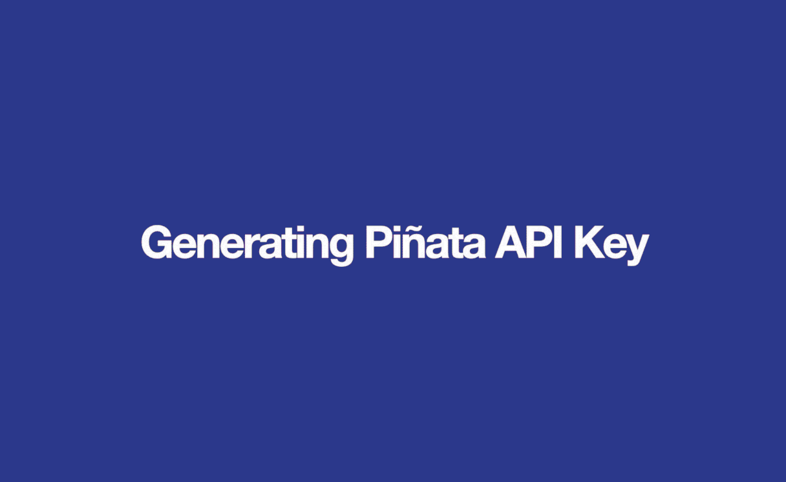

1. Click the top right menu and select **"API Keys"**.
2. From there, click the **"+ New Key"** button to open up the "Create a New API Key" dialog.
3. Click the "Pinning" tab to expand, and select the "PinFileToIPFS" and "PinJSONToIPFS" options.
4. Enter whatever key name you desire, and click "Create".


### 1.3. add API key to factoria

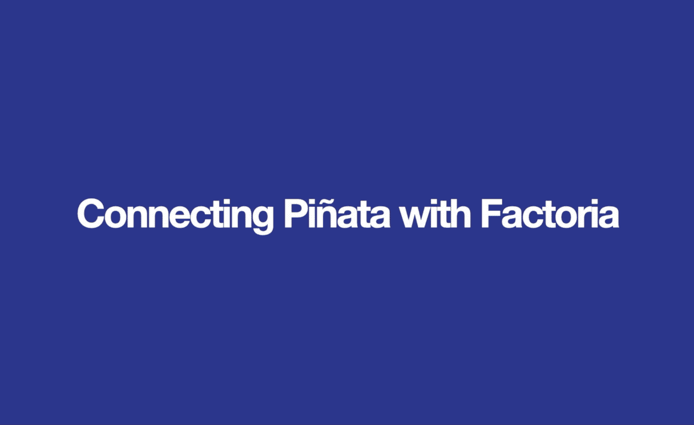

1. Copy the API key from Pinata, open the "Settings" tab on Factoria, and paste the key to the "Pinata API Key" field.
2. Copy the API secret from Pinata, and paste the secret to the "Pinata API Secret" field.
3. Click "Save".
4. You will see the browser secure storage asking you if you want to update the password. Select "Update Password". This way you won't have to enter the API keys every time.

> Note that this stores the API key and the API secret on your browser's **secure storage**, and no privacy is compromised.


## 2. deploy contract


Go to the [Contract tab](https://rinkeby2.factoria.app/contract/) and click "Create". Here you can customize and deploy your contract.

If you are not sure what to fill out, just fill out the **name** and **symbol**. The rest of the attributes (**placeholder uri**, **supply**, **base uri**) can be left empty because they can be configured later (through an additional transaction).

> **RECOMMENDED**
>
> Even if you don't have a specific total supply number in miind, try setting the **supply** to something like 100 (a non-zero number) so you can see the placeholder tokens right after you deploy.

Once you click "Create", it will let you sign the transaction and deploy.

Congratulations! You have deployed your own ERC721 NFT contract!


## 3. airdrop


Deploying a collection doesn't mean anyone can immediately start minting from it. You will probably want to do a controlled rollout over time.

Let's start the rollout with an "airdrop" option. Basically you're going to let a couple of selected addresses to **mint for free (0 ETH)**, which includes yourself.


1. Go to the [Invite tab](https://rinkeby2.factoria.app/invites/)
2. Paste in some addresses (Include your own Ethereum address, so you can try for yourself!)
3. Click "Create on IPFS" and enter the Pinata API key and secret. It will generate an invite merkle tree and save it on IPFS.
4. Click "Connect to an NFT collection", it will display all your collections.
5. Select a collection and it will send you to the collection edit page.
6. Set the mint price for this list
7. Set the mint start time for this list
8. Set the mint limit: **Set it to be AT LEAST 1**, otherwise you can mint at most 0 tokens (which means you can't mint).
9. Press "Invite" and sign the transaction

And that's it!

Internally, you're creating an `Invite` object that looks like:

```
{
  start: 0,
  price: 0,
  limit: 3
}
```

By setting the price to 0, you are allowing this list to mint for 0ETH.


## 4. mint


Now you've invited yourself to an airdrop, let's go mint some tokens! Factoria provides two ways to mint, by default (But you can create your own interface too, since everything can be loaded from Ethereum and IPFS):

1. **Vending Machine:** Just select the number of tokens to mint
2. **Storefront:** The minters see the entire directory of available NFTs and pick the one they want to mint

### minting with vending machine

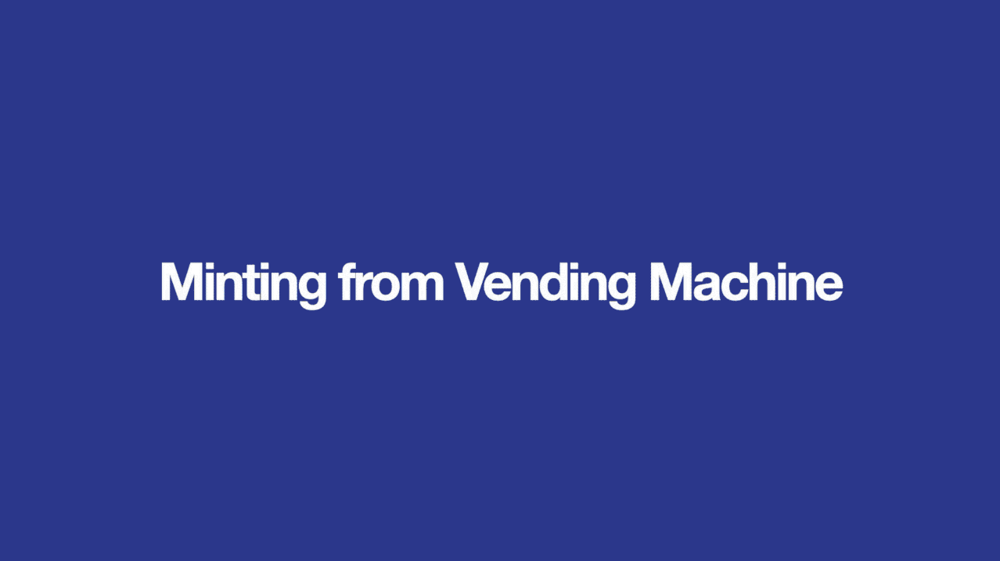

Let's first try minting through vending machine:

1. Open the "vending machine" page for your collection
2. You should see some options in the "Minting options" table. (If you don't see any, go back to step 3 and invite yourself to an airdrop)
3. Click "select" on the option you want to mint with
4. Approve the transaction and wait until it confirms.

It should have minted the token and you should see a link to the minted tokens on NFT marketplaces (Opensea and Rarible)

### minting with storefront

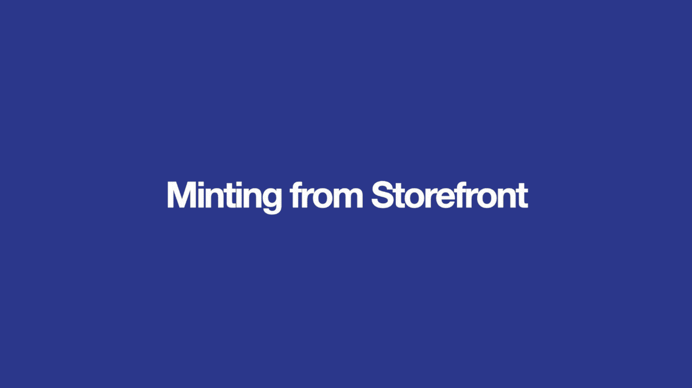

1. Open the "storefront" page for your collection
2. Click a token you want to mint.
3. Click "Mint". It will reveal the minting options. Or if you're not invited it will say you're not invited.
4. Click "select" on the option you want to mint with
5. Approve the transaction and wait until it confirms.


## 5. presale

A "Presale" is not so much different from an "Airdrop", except that the invited people has to pay some ETH to mint.  This means the process is pretty much the same as the Airdrop option.

The only difference is you set the "mint price" to the desired mint price you want to charge the minters. Let's take a look at how it works:

### 5.1. creating a presale list

Creating a list is literally just copy and pasting a list of addresses.

When you click "Create on IPFS", Factoria creates an invite key (Merkle root) from the list, and stores the list on IPFS (so that minters can permissionlessly mint without relying on a server).

In this example, I have invited 12 addresses, including my own address (so i can test it with my own address):


### 5.2. connecting the presale list with a contract


Once you have created a list, you need to connect that list to a contract. "Connecting" a list to a contract involves:

1. specifying the mint price for the list
2. specifying the mint start time for the list
3. specifying the mint limit per address for the list

Here we are creating an Invite condition that looks like:

```
{
  price: 10000000000000000,
  start: 0,
  limit: 7
}
```

The price is in wei, so in this example, the minter:

- needs to pay 10000000000000000 wei (0.01ETH) per each token
- and can mint up to 7 tokens from the address


### 5.3. minting with a presale invite

Now that we've invited a bunch of addresses, let's take a look at how one would mint using these invites. Let's try minting from the storefront interface.

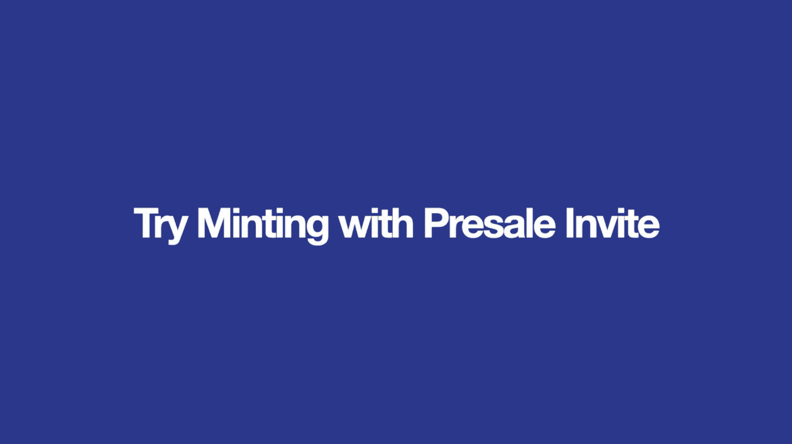

Note that I now have **2 invites**. This includes:

1. The airdrop invite I sent to myself earlier
2. The new Presale invite

We will use the Presale invite to mint (Although this wouldn't make sense in a real world since I can just use the airdrop invite to mint for free).

We can see that the mint price is now **0.01ETH**.

## 6. public launch

### 6.1. creating a public invite

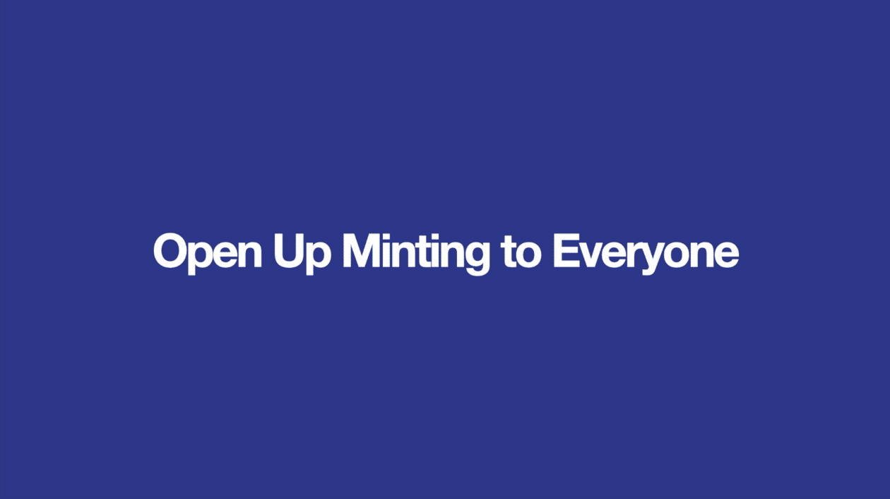

The "public launch" sounds like a completely different thing, but in reality it's just another type of invite. Basically it's an invite WITHOUT a list. To publicly release your collection,

1. click the "public release" button from the dashboard
2. Set the invite settings
3. Click "Invite"

It's exactly the same as inviting a list, except that the **invite key** is `0x0000000000000000000000000000000000000000000000000000000000000000` (which means no list).

### 6.2. minting with a public invite

Minting with a public invite is the same as minting with other private invites. Let's visit the minting page again:

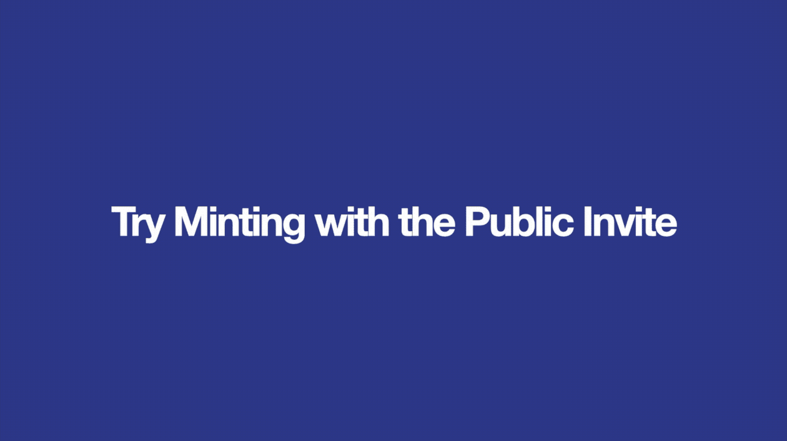


Now I have another invite with an invite key `0x0000000000000000000000000000000000000000000000000000000000000000` and a minting price of `0.1ETH`. This is the public release. Click "Select" and you can see that the wallet asks you to send 0.1ETH.


## 7. publishing files

### 7.1. importing a folder to browser local storage

Let's import a file folder to Factoria's local storage. By default, all files are private until you explicitly publish to IPFS.

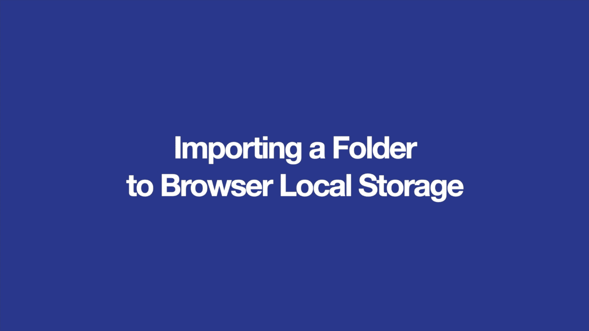

1. Go to a collection dashboard and click "edit" to visit the edit page.
2. From the edit page, click "Add files". This will send you to an "Add a Folder" page.

### 7.2. publishing the imported folder to IPFS

Everything is privately stored locally on your browser storage when you import. When you're ready to make your files public, you can publish to IPFS.

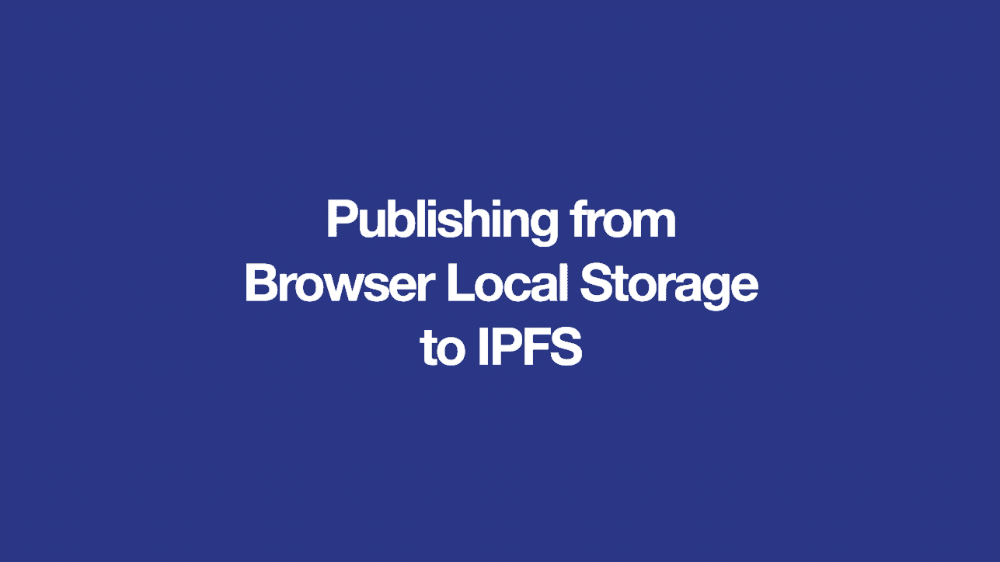

1. From the Metadata folder, click "Publish to IPFS".
2. This will pop up a dialog which will let you select your Pinata API key.
3. Confirm the dialog and it will start uploading to IPFS.
4. When the folder is successfully uploaded, it will display the published IPFS URI.

### 7.3. connecting a published IPFS folder with a collection

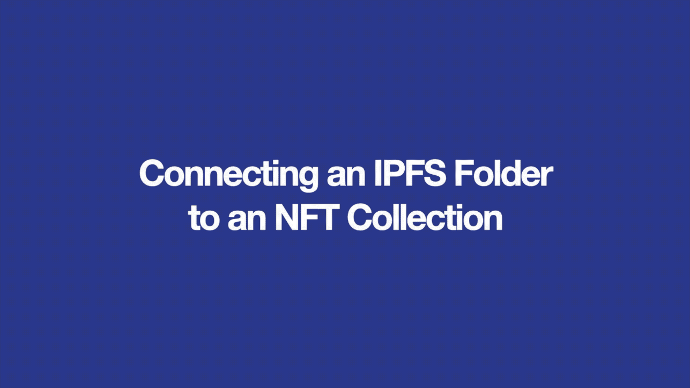

1. Go to a metadata folder you would like to use, and click the "Connec to NFT Collection" button.
2. This will display all your collections. Select a collection.
3. Click "Save on Blockchain" to apply the IPFS folder to the contract.


### 7.4. updating NFT metadata on marketplaces

Now that we've published the metadata and files on IPFS, let's refresh the metadata on marketplaces so they start displaying the updated NFT instead of the placeholder.

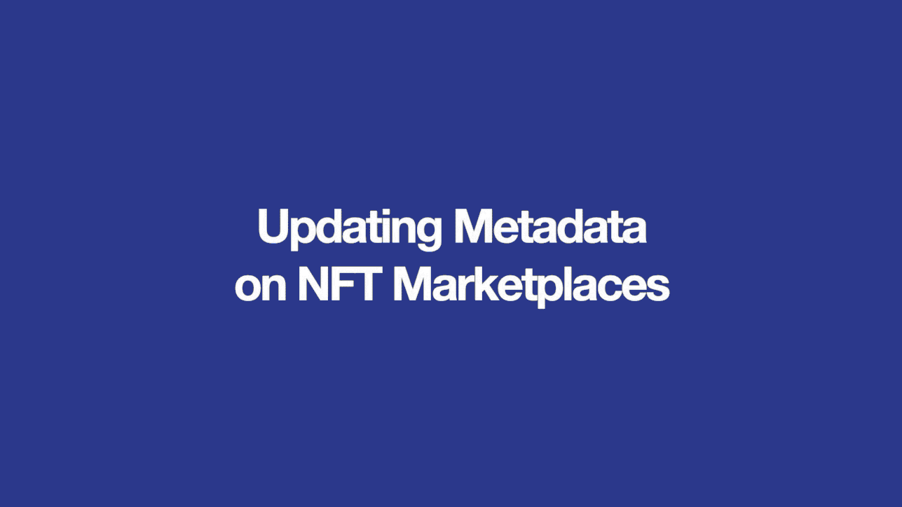


---

# system overview

There are 5 sidebar tabs on factoria.

## 1. contract

This is where you manage all your smart contracts. It displays all your contracts deployed with factoria, and lets you manage and edit them.

> **NOTE**
>
> Everything in this tab is publicly accessible since they are loaded straight from Ethereum and IPFS.

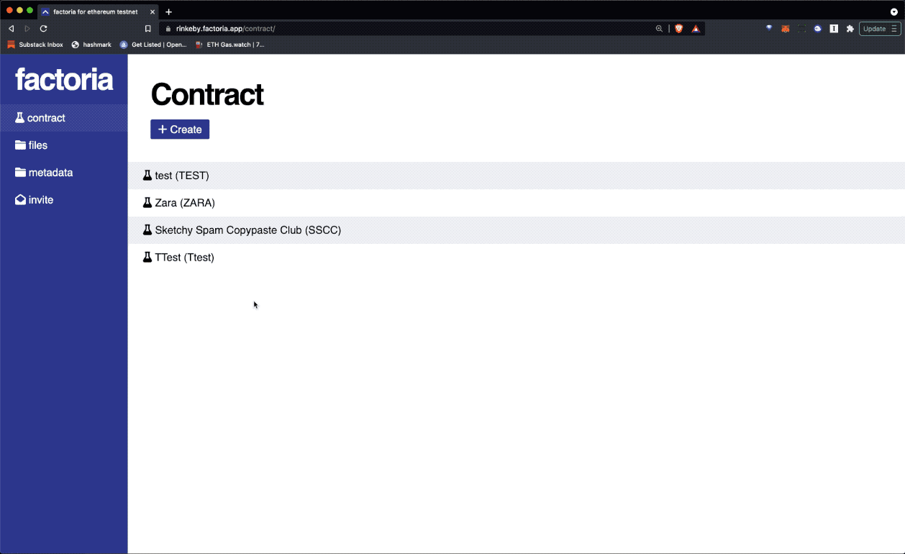

## 2. files

This is where all your files are stored **locally** in your browser storage ([IndexedDB](https://developer.mozilla.org/en-US/docs/Web/API/IndexedDB_API)). Here's what it looks like:


> **Note**
>
> Currently factoria supports a flat folder (no nested folders), so make sure to not include nested folders.


## 3. metadata

This is where all your NFT metadata files are stored **locally** in your browser storage ([IndexedDB](https://developer.mozilla.org/en-US/docs/Web/API/IndexedDB_API)). Here's what it looks like:

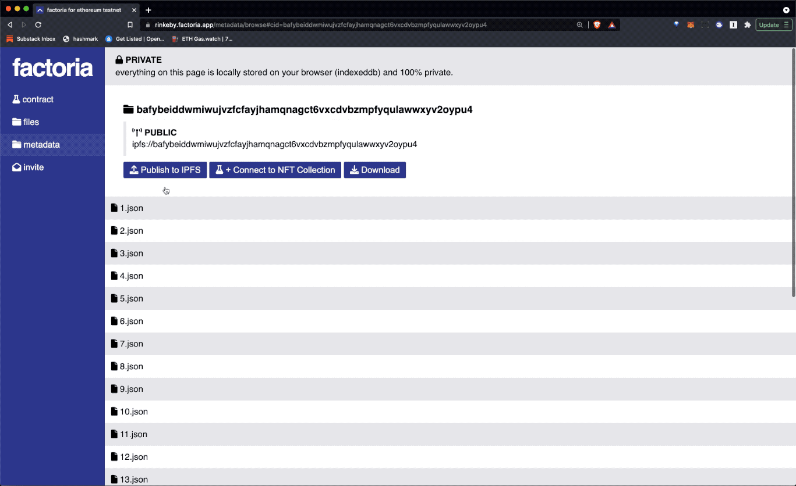

There are 2 ways the `metadata` folder can be populated:

1. **Manually Import:** You ccan directly import your own metadata folder to the `metadata` tab.
2. **Automatically Generate:** For convenience, Factoria automatically generates a metadata folder whenever you import a file folder.

### 3.1. manual import

Importing manually is the same as importing to the files folder.

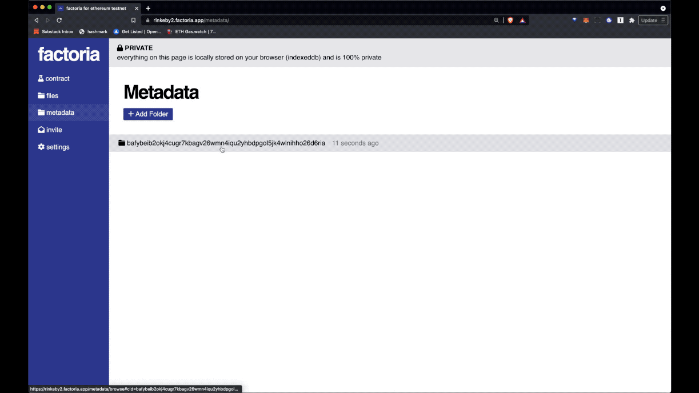

### 3.2. automatic generation

When you import a folder in the **files** tab, factoria automatically generates a metadata folder for you, which is convenient for many cases. For example, if your uploaded image folder looks like this:

```
alice.png
bob.png
carol.png
```

factoria automatically generates a folder under the `metadata` tab that looks like this:

```
1.json
2.json
3.json
```

where each json looks something like this:

```json
// 1.json
{
  "image": "ipfs://bafybeidk33nlw7ocphumz3cl4scznwiq7q2qgytuiavukr6hsjbp37lcee/alice.png"
}

// 2.json
{
  "image": "ipfs://bafybeidk33nlw7ocphumz3cl4scznwiq7q2qgytuiavukr6hsjbp37lcee/bob.png"
}

// 3.json
{
  "image": "ipfs://bafybeidk33nlw7ocphumz3cl4scznwiq7q2qgytuiavukr6hsjbp37lcee/carol.png"
}
```

Check out the following example (Note that the user is importing a **file folder**, but factoria creates an additional **metadata folder** and redirects the user to this folder):

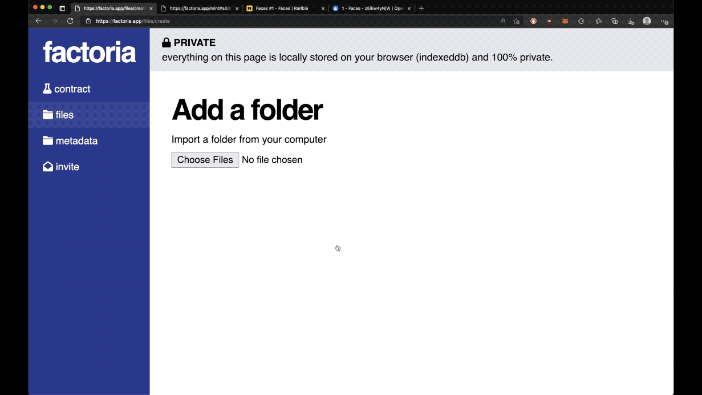


> **NOTE**
>
> factoria automatically generates the image folder IPFS CID and uses it to generate the image attribute.

But you do not have to use the auto-generated metadata. You can import your own metadata folder.


## 4. invite

This is where you can invite addresses to a collection.

When you enter a new line separated group of addresses and press "Create on IPFS", factoria:

1. stores the list on IPFS
2. creates an invite key (merkle root) from the list
3. and displays a "Connect to an NFT collection" button

When you click the "Connect to an NFT collection", it displays all your collections. You can select one to go to the contract invite page, where you can set the invite details and submit to the blockchain.

## 5. settings

The settings page lets you store IPFS (Pinata) API keys so you can use later whenever Factoria requires an API key.

---

# howto

## 1. export metadata

You can easily export the metadata from the browser:

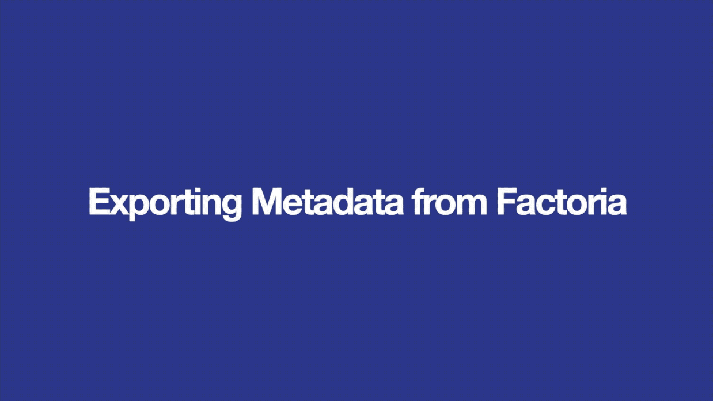

Once you exported, you can make custom updates to the metadata and re-import.

## 2. generative art / PFP NFT

### 2.1. how to do it

**Generative art NFT projects** are NFTs where the images representing the NFTs are algorithmically generated by combining multiple image layers. 

With Factoria, deploying and managing a generative art NFT collection is very easy and cheap. All you need to do is:

1. Build your generative art
2. Use Factoria to upload the art to IPFS, deploy the contract, manage invites, and do release management.

**First step,** build your metadata and images. You can find many tutorials around the web. Some examples:

- Generative Art Tutorial: https://medium.com/scrappy-squirrels/tutorial-create-generative-nft-art-with-rarities-8ee6ce843133
- Generative Art Builder Library: https://github.com/NotLuksus/nft-art-generator

**Second step,** once you have generated all the images and metadata, open Factoria and:

1. Deploy a collection on Factoria
2. Let people mint from the placeholder tokens
3. Import the generated metadata files to Factoria
4. Import the generated image files to Factoria
5. Publish the metadata folder and the files folder
6. To reveal the metadata, connect the metadata folder to your collection and publish

> Basically, once you have all the images and metadata, you simply need to follow the [Quickstart](#quickstart).

### 2.2. i already have all the files, why should I use factoria?

You could hire a developer to write Solidity contract, implement IPFS infrastructure, and many complicated things around deploying an NFT collection, or you could use Factoria. Here are the benefits:

1. **Easiest to deploy:** You deploy your own contract with a click of a button. No need to write solidity contracts on your own. Every collection is a **standalone ERC721 contract you own** (Not a "shared contract" provided by NFT marketplaces).
2. **Cheapest to deploy:** No need to pay thousands of dollars gas cost for deployment. **The deployment of the ENTIRE collection costs around $100 ~ $150 in gas cost, regardless of how many items are in your NFT collection.**
3. **Zero development cost:** You don't have to hire a solidity developer for $50,000 to develop a contract. It's 100% automated and you can instantly deploy through the web interface. And the entire IPFS publishing workflow is built-in to the web app so you don't have to write any code to work with IPFS.
4. **Powerful mint permission engine:** **Airdrop, Presale, public launch, dutch auction, timed launch, expiring invites**, and many more. Before Factoria, this was not accessible to most people. And even the ones who used these technique have been either using centralized and insecure offchain solutions, or spend a lot of money to hire a developer to build out a whole infra for this. With Factoria, you can implement all these rollout strategies with **a simple web interface WITHOUT relying on any 3rd party.**
5. **Cheap minting cost:** Factoria is extremely efficient and has one of the lowest gas cost implementations for minting. If you care about your community, you should try to minimize gas fee waste. Factoria contract is specialized for NFT collections with fixed supply (PFP NFT collection, generative art NFT collection, etc.) and very efficient.
6. **Open and Decentralized:** Factoria is 100% Open and requires NO 3rd party. This means you will never get locked into some "NFT platform". Everything is all yours.


## 3. adding rarity to your NFT

### 3.1. what is "rarity"?

Every NFT item is defined by its metadata JSON file, and the concept of "Rarity" comes from the [attributes](https://docs.opensea.io/docs/metadata-standards#attributes) property of an NFT metadata file. Here's an example:

```json
{
  "image": "ipfs://QmYsWYyQL2rTykTb8a9erJ6cSRRLqpC1sk3NE7n6SbgAaJ",
  "attributes": [
    {
      "trait_type": "Mouth",
      "value": "Bored"
    },
    {
      "trait_type": "Background",
      "value": "Aquamarine"
    },
    {
      "trait_type": "Hat",
      "value": "Girl's Hair Short"
    },
    {
      "trait_type": "Eyes",
      "value": "Scumbag"
    },
    {
      "trait_type": "Clothes",
      "value": "Biker Vest"
    },
    {
      "trait_type": "Fur",
      "value": "Black"
    }
  ]
}
```

People calculate the "rarity" metric based on how often certain `"value"` appears for each `"trait_type"`. In the example above, there are 6 attributes:

- **Mouth:** `"Bored"`
- **Background:** `"Aquamarine"`
- **Hat:** `"Girl's Hair Short"`
- **Eyes:** `"Scumbag"`
- **Clothes:** `"Biker Vest"`
- **Fur:** `"Black"`

You can calculate the "rarity" of the item above by:

1. Collecting all existing items in the NFT collection
2. Downloading all their metadata JSON file from IPFS
3. Running some data mining operation to find out how often eachh `trait_type/value` pair shows up

Basically, there is no field you can set on an individual NFT item where you specify the "rarity". Instead the rarity is calculated from analyzing the entire collection.

### 3.2. how do people implement "rarity"?

Since it's all about the `attributes`, you simply need to customize the attributes in your NFT metadata. There are two different ways you can do this:

1. **Create metadata first, and generate images from the metadata:** This is the typical approach taken by **generative art NFT projects** (where the images are algorithmically generated by combining multiple image layers) and you can find tutorials easily (Here's an example: https://medium.com/scrappy-squirrels/tutorial-create-generative-nft-art-with-rarities-8ee6ce843133)
2. **Create images first, and attach attributes to the image:** If your NFT project is NOT a generative art (For example, each NFT item is an original art piece directly crafted by the creator), you can still attach metadata to your NFTs.

### 3.3. how to implement rarity in an NFT collection that's NOT generative art?

You simply need to add `attributes` property to your metadata. When you import raw images to Factoria, it auto-generates metadata that looks like this:

```json
{
  "image": "ipfs://bafybeidk33nlw7ocphumz3cl4scznwiq7q2qgytuiavukr6hsjbp37lcee/1.png"
}
```

To add rarity, you need attributes. And these attributes are what lets people compute how rare an NFT is (within the context of the entire collection). Here's an example:

```json
{
  "image": "ipfs://bafybeidk33nlw7ocphumz3cl4scznwiq7q2qgytuiavukr6hsjbp37lcee/1.png"
  "attributes": [
    {
      "trait_type": "Mouth",
      "value": "Bored"
    },
    {
      "trait_type": "Background",
      "value": "Aquamarine"
    },
    {
      "trait_type": "Hat",
      "value": "Girl's Hair Short"
    },
    {
      "trait_type": "Eyes",
      "value": "Scumbag"
    },
    {
      "trait_type": "Clothes",
      "value": "Biker Vest"
    },
    {
      "trait_type": "Fur",
      "value": "Black"
    }
  ]
}
```

To learn how to do this, check out the ["Customize NFT metadata"](#_5-customize-nft-metadata) section below.

## 4. customize NFT metadata

For convenience, factoria [auto-generates a metadata folder](#_32-automatic-generation) from your imported files folder whenever you import.

But you do not have to use the auto-generated metadata. You can [import your own custom metadata folder](#_31-manual-import) and connect that folder with your collection, instead of using the autogenerated metadata folder.

### 4.1. browse imported metadata on factoria

First, let's take a look at the already imported metadata.

From your collection dashboard, look for the **base uri** field. You will see a "local storage" link. Click that link to visit the `metadata` folder that's currently connected to this collection.

> NOTE
>
> This will only work if you used this same browser to locally import the folder. Remember that factoria itself doesn't have a server or a backend database. So until you publish the folders to IPFS, they are only on your computer.

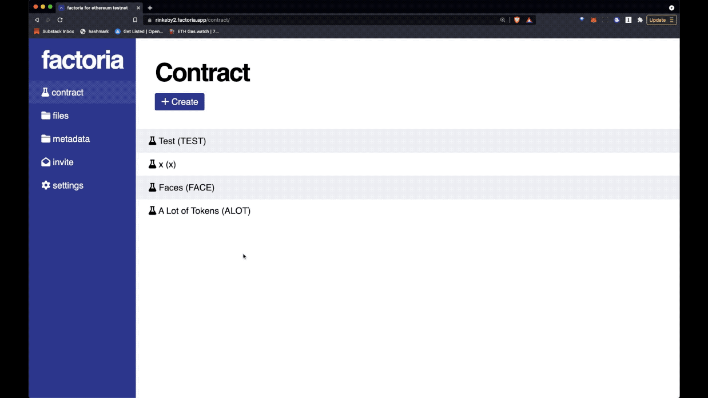

### 4.2. export metadata from factoria

To customize your metadata, you will need to export it to your computer first. 


If you are exporting an auto-generated metadata folder, each metadata JSON file will contain only an `"image"` attribute.

### 4.3. customize metadata

Every NFT item has its own metadata JSON file. To customize the metadata, this is the only file you need to update. NFT metadata follows the ERC721 metadata standard (Learn more here: https://docs.opensea.io/docs/metadata-standards).

In this case, we are interested in updating the `attributes` array, which lets you store arbitrary attributes to an NFT item. Open the JSON files with an editor, and make updates to the `attributes` array. Here's an example:

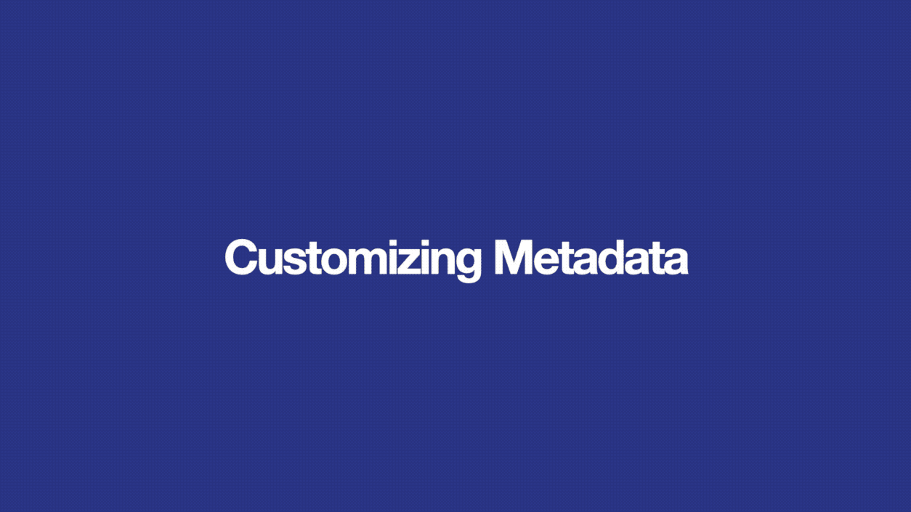

### 4.4. re-import the customized metadata to factoria

Now that we've made some updates to the original metadata, let's:

1. Re-import the metadata folder to factoria
2. Publish the imported metadata folder to IPFS
3. Connect the published IPFS folder to the contract
4. Check what it looks like: Now each item should display a table of attributes we've just set


> **NOTE**
>
> Make sure to import the updated metadata files to the "metadata" folder, not the "files" folder.


## 5. update existing invites

You can update minting conditions for existing invites.


## 6. invite-only NFT collection

To create an invite-only NFT collection, you can:

1. Deploy a contract
2. Invite a private address list
3. If you want to invite more, just invite more address list

## 7. making collection permanent

Factoria makes editing super simple. You can edit the following collection attributes as many times as you want:

- **placeholder uri:** The metadata uri that will be used until you publish your NFT collection metadata folder using the `base uri`
- **base uri:** The IPFS URI of the folder that contains all the metadata files in your collection
- **total supply:** The total supply of your collection. This is important because even if you had 1000 items in your metadata folder, if the total supply is 100, the 900 of the items WILL NOT be tokenized.

**BUT,** you may want to make these attributes **permanent** at some point, depending on the type of collection you're doing.

For example, you may want to fix the total supply as permanent at some point (When you start allowing people to mint). Otherwise people will not want to mint the tokens because you as the admin can always mess with the total supply, etc.

To make your collection permanent, you can simply check the **permanent** checkbox and click "Save on Blockchain" to save the setting:

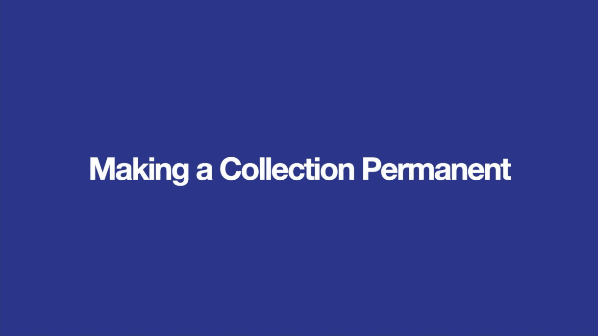

Once you do this, you will no longer be able to make updates to the `base uri` , `placeholder uri`, and `total supply`. If you try to change, the transaction will fail. Here's an example:

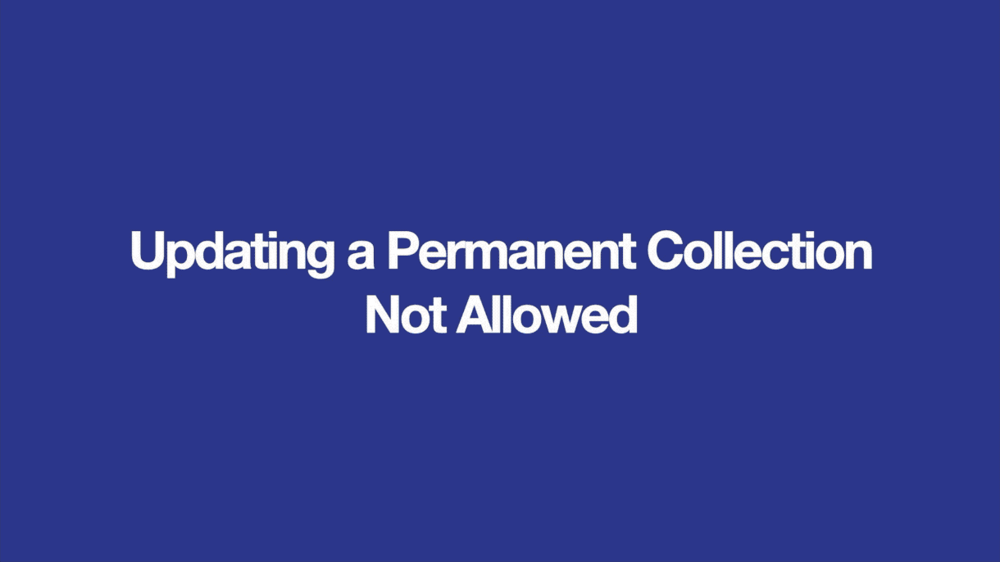


## 8. pause minting

Sometimes you may realize that you made a mistake with publishing metadata, and may want to pause the minting.

To do this, you simply need to update the existing invites to **set the mint limit to 0** for each invite.

## 9. withdraw money from contract

As people start minting from your collection, your contract will start getting incoming funds. At some point you will want to withdraw the money from the contract.

Just go to a collection dashboard, and click the "Withdraw" button. The button should always display the total balance of the contract.


> **NOTE**
> 
> Only the owner (The person who deployed the contract) can withdraw money from the contract.


## 10. build your own vending machine

You can set up your own vending machine website simply by cloning a git repository.

Check out Skinnerbox, a minimal vending machine for F0: https://github.com/factoria-org/skinnerbox

## 11. set up royalty

There are 2 ways to set up royalty (and you need to do both if you want to support royalty everywhere).

1. **manually setting royalty:** manually set royalty rate for your contract on NFT marketplaces.
2. **automatically setting royalty:** declare the royalty settings directly on the contract, following the [NFT royalty standard (EIP-2981)](https://eips.ethereum.org/EIPS/eip-2981).


### A. Manually Set Royalty

Some marketplaces (such as Opensea and Rarible) let you set the contract-wide royalty through their web UI.

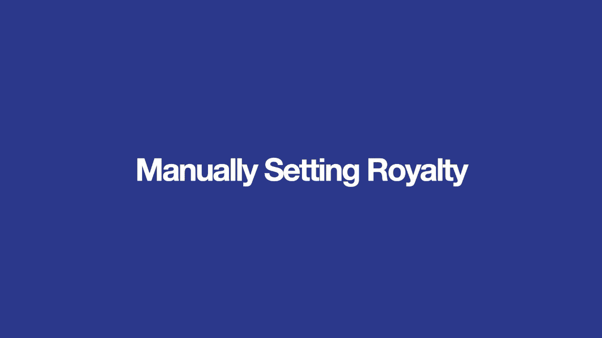


### B. Automatically Set Royalty

More and more NFT marketplaces (such as Looksrare) are starting to support the EIP-2981 NFT royalty standard (learn more here: https://eips.ethereum.org/EIPS/eip-2981), which lets you declare royalty settings directly on the contract. By declaring the royalty on the contract, you do not need to manually set the royalty for every marketplace out there. (At least that's the theory).

The F0 contract supports a plug-and-play interface for royalty logic. 


1. Go to the "royalty" tab and select a contract you wish to update.
2. Click "edit" to go to the royalty edit page.
3. Enter the royalty percentage (out of 100) and the royalty receiver address.

The first time you set the royalty, you will need to make 2 transactions:

1. Setting the royalty ratio on the royalty contract
2. Connecting the royalty contract with your NFT contract

But from the second time, you will only need to make the first transaction ("setting the royalty ratio").

Also, you can make the royalty ratio permanent by selecting the "permanent" checkbox. Once you update with a "permanent" option, you won't be able to edit the royalty ratio. Your minters may want the royalty ratio to be permanent so it is recommended that you make the ratio permanent before launching.

> Note that you still need to manually set the royalty on some marketplaces like Opensea and Rarible. We hope that all the NFT marketplaces will eventually adopt the standard so we don't have to manually go around setting royalties, but for now we need to do both the "manual" and the "automatic" approaches to cover all cases.


## 12. build customized apps

To directly use Web3 and IPFS to build your own web app around your NFT collection, see [developers documentation](https://dev.factoria.app/f0)

To use a JavaScript library that abstracts all the complicated details of working with Web3 and IPFS, see [F0.JS](https://f0js.factoria.app/#/)


## 13. splitting minting revenue

Have collaborators and want to automatically split revenue among the members? 

Factoria makes this simple too. You just need to create a group address that represents all the members, and set that address as the "withdrawer". Then the revenue will be automatically split and shared among the collaborators.

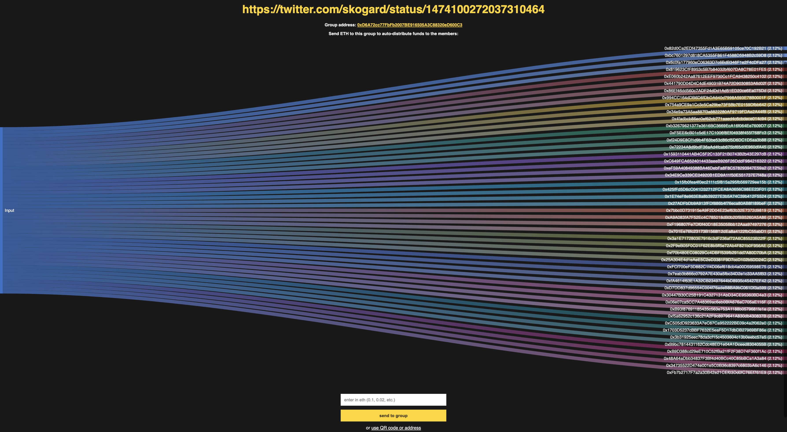

There are two ways to split revenue:

1. The owner withdraws directly to members' addresses
2. The owner withdraws to a group address, and the members can withdraw from the group address

> You can learn more about how Moneypipe works here: https://moneypipe.xyz

Let's take a look at how Moneypipe can be incorporated into the Factoria workflow:

### A. Withdraw directly to the members

You can use [Moneypipe Stream](https://stream.moneypipe.xyz) to achieve this.

With this approach, when the contract owner withdraws money from the contract, the revenue gets split and sent to all members in realtime. Convenient, but becomes expensive to withdraw when there are many members in the group.


Here's how to do this with Factoria:

1. The owner creates a group with a "stream" mode, made up of the collaborators' addresses
2. The owner goes to the admin page of the Factoria collection and sets the group address as the collection's "withdrawer"
3. Later when it's time to withdraw the revenue, the owner goes to the admin page and click "withdraw" to withdraw the revenue. The funds will be automatically split and sent to the members in the same transaction.

### B. Allow members to withdraw

You can use [Moneypipe Buffer](https://buffer.moneypipe.xyz) to achieve this.

Instead of withdrawing directly to all the members, the contract owner withdraws funds to a group address. Each member can then withdraw their share from the group address. Requires an additional "withdrawal" step for each member, but the withdrawal cost is cheap and fixed regardless of how many members there are.


Here's how to do this with Factoria:

1. The owner creates a group with a "buffer" mode, made up of the collaborators' addresses
2. The owner goes to the admin page of the Factoria collection and sets the group address as the collection's "withdrawer"
3. Later when it's time to withdraw the revenue, the owner goes to the admin page and clicks "withdraw" to withdraw the revenue. This time, the funds will be sent to the group address (Not directly to the members' addresses).
4. Each member can go to the admin page to find the URL for the Moneypipe Buffer landing page.
5. The members can then visit the Moneypipe buffer landing page and claim their share of the revenue.

## 14. splitting royalty revenue

This works the same as spliting the revenue for initial minting.

1. Set up the revenue split as explained in the previous section.
2. Go to various NFT marketplaces and set your **F0 contract address** as the sole royalty receiver address.
3. Once that's finished your contract will collect not only the minting revenue but ALSO the royalty revenue from the marketplaces.
4. Now ALL of your revenues are stored in the same pot (in the contract), so all you need to do as the owner is withdraw, and everyone will get their shares of the revenue (both the minting revenue and the royalty revenue)

Because royalties are enforced by the NFT marketplaces that list NFTs, you need to set the royalty recipient address from all NFT marketplaces. You can learn more about this here:

- **Opensea:** https://docs.opensea.io/docs/10-setting-fees-on-secondary-sales
- **Rarible:** https://rarible.medium.com/list-your-collection-on-rarible-com-for-secondary-sales-with-multiple-royalties-512cf4221f6 (The article explains how to split royalties directly from Rarible, but we recommend NOT doing that and instead collecting all revenue to the contract, and then splitting when withdrawing from the contract. That way it works exactly the same for all marketplaces)
- **Royalty Registry:** Because it is inconvenient to deal with royalties across various NFT marketplaces, a project was built to set the royalty once and apply it everywhere. You can use Royalty registry to set the royalty (not supported for Opensea so you still need to set it on Opensea additionally), where you set the contract address as the royalty recipient, and split when the owner withdraws from the contract.

If you have questions, please join [Discord](https://discord.gg/BZtp5F6QQM) and ask. Also make sure to test these on testnet Factoria before doing on mainnet.

---

